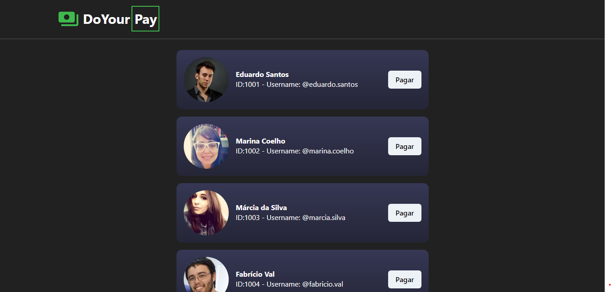

  <a href="#-tecnologias">Tecnologias</a>&nbsp;&nbsp;&nbsp;|&nbsp;&nbsp;&nbsp;
  <a href="#-projeto">Projeto</a>&nbsp;&nbsp;&nbsp;|&nbsp;&nbsp;&nbsp;
  <a href="#-layout">Layout</a>&nbsp;&nbsp;&nbsp;

 

  

## 🚀 Tecnologias

Esse projeto foi desenvolvido com as seguintes tecnologias:

- Typescript
- React
- ChakraUI

## 💻 Projeto

Projeto idealizado pela plataforma NewTab Academy, que consiste na simulaçao da realizaçao de pagamentos. Neste projeto aprendi conceitos
a respeito da utilizaçao da biblioteca React, como criaçao e ciclo de vida dos componentes, useState, useEffect, useContext e criaçao de hooks personalizados. 

## 🔖 Layout

O layout do projeto foi adaptado a partir do layout disponivel nesse [link](https://docs.google.com/document/d/1RsH8ZT9QPakmenJGppeFqBbLVDL_ZTThrICWtIBijhA/edit?usp=sharing).

Code by Renato Sousa